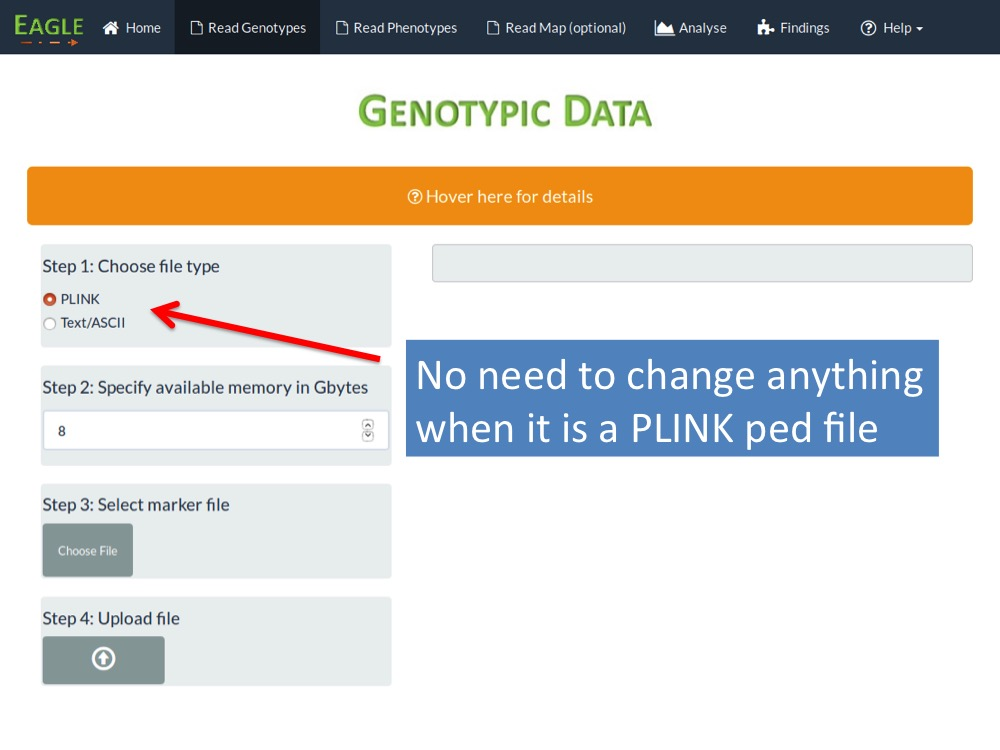
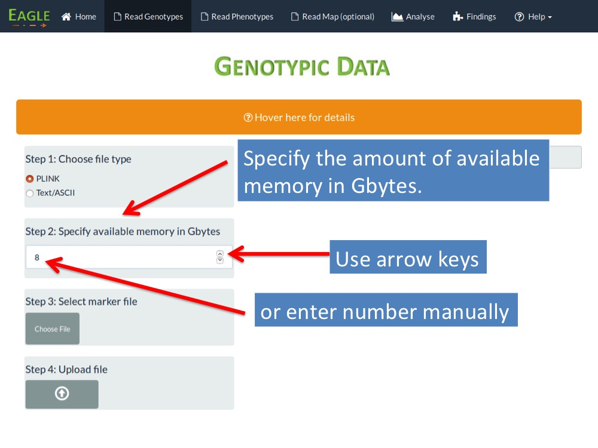
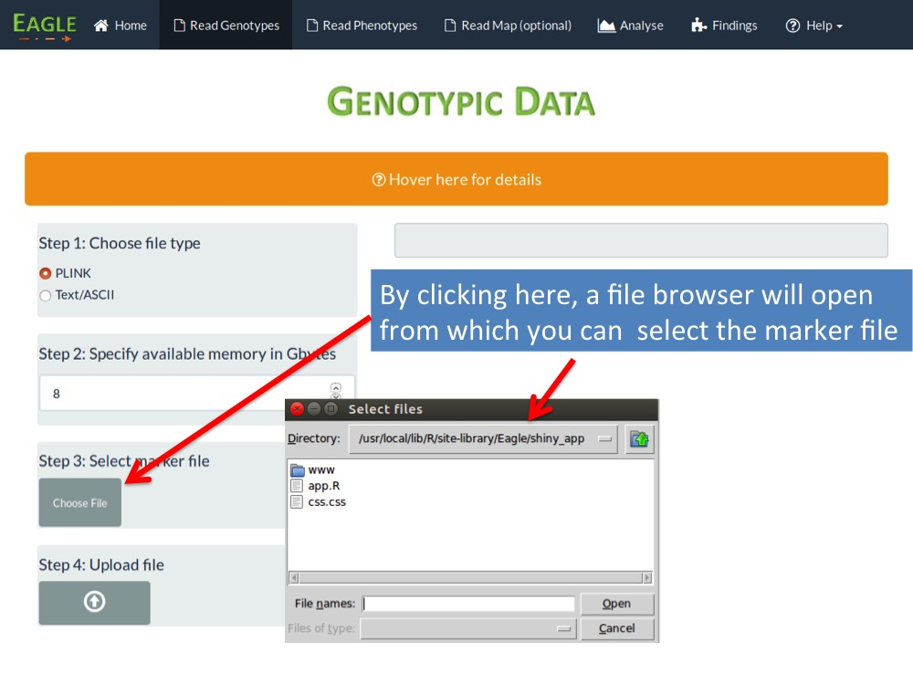
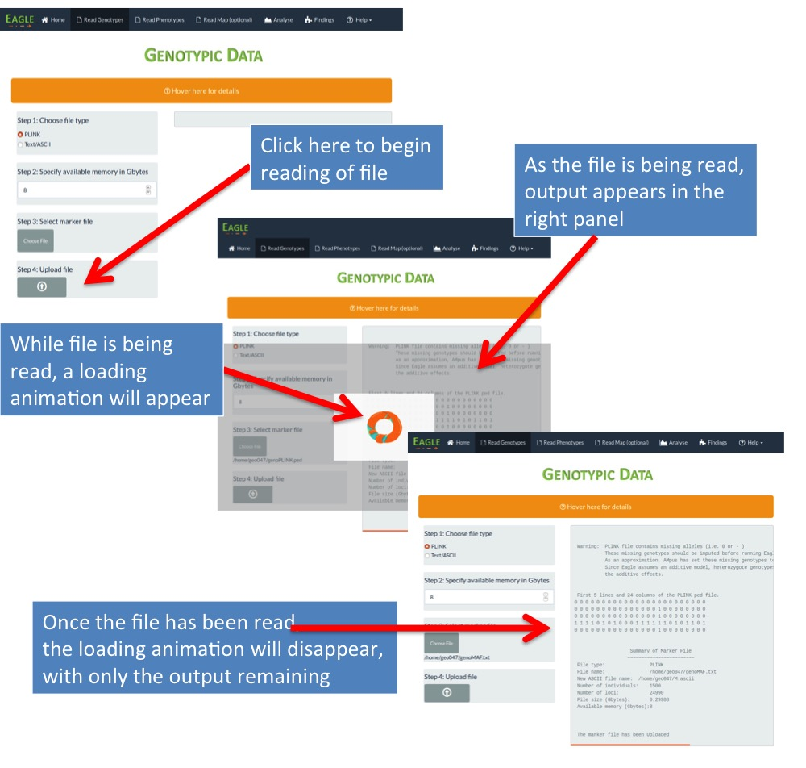
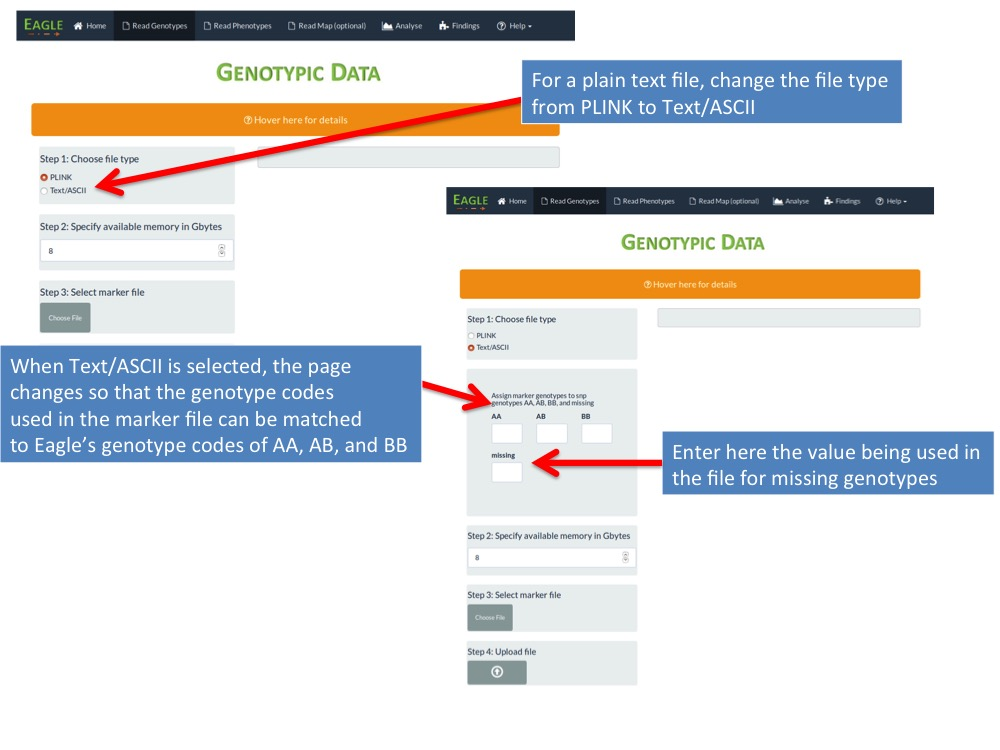

---
output:
  html_document:
    toc: false
    fig_caption: yes
    css: "/home/geo047/gitHUB_WMAM/MyPackage/CSS/example/assets/css/styles.css"
  pdf_document:
    highlight: null
    number_sections: yes
vignette: >
  %\VignetteIndexEntry{Quick Start Guide}
  %\VignetteEngine{knitr::knitr}
  \usepackage[utf8]{inputenc}
---
<head>
<meta charset=utf-8>
<meta http-equiv=X-UA-Compatible content="IE=edge">
<title>One-column fixed-width responsive layout</title>
<meta name=viewport content="width=device-width, initial-scale=1">
<meta name=Description lang=en content="ADD SITE DESCRIPTION">
<meta name=author content="ADD AUTHOR INFORMATION">
<meta name=robots content="index, follow">
</head>
<body>
<div class=container; margin: 0 0 0 0; >
<div class=header >
<font size="6"; color="white"> <b>EAGLE 1.0</b>: <i>Quick Start Guide</i> </font>
<br>
<font size="4"; color="white">  <b>  Andrew W. George, </b>  <br>
<b> Data61, CSIRO, Australia </b> </font>
</div>
<div class=content>
<div class=main>
<h1><b> Some Background on the Methods</b> </h1>
<p>
Eagle is a software package for genome-wide association mapping in populations of arbitary structure. The 
population may be of plants, animals, or humans. Our association mapping method is based on linear mixed 
models. As such, it is best suited to the analysis of data from quantitative/continuous traits. However, 
linear mixed models are robust, and we have had success in also analysing data from disease/binary traits. 
Our association mapping method differs from most other methods in that we do not test each marker-trait association separately. Instead, we construct a model that fits all marker-trait associations simultaneously and identifies the "best" set of loci in strongest association with a trait. 


<h1><b> Getting Started </b> </h1>

Eagle is written in  [R](https://www.r-project.org/about.html). There are various ways of installing Eagle, depending upon your operating system and preference. See our Installatiion Guide for details. Here, we will assume that you have [R](https://www.r-project.org/about.html) and that you have successfully installed Eagle. 

To begin, start an interactive session in [R](https://www.r-project.org/about.html) and type the following at the R prompt
```{r eval=FALSE}
library("Eagle")
```
Nothing appears to happen but this loads the Eagle package into R and makes its functions available to the user. 


</p>
<h1> <b> Running Eagle the Easy Way </b> </h1>
<p>
There are two ways in which the functions in Eagle can be run. One is via the traditional approach of writing an R script with the Eagle functions that read in the data and perform the analysis. R users will be familar with this approach. See our UserManual for details.  
</p>

<p>
Our preferred way of interacting with Eagle, especially if your are not a regular R user,  is through our browser-based user interface (UI). 
To run our UI, at the R prompt type 
</p>
```{r eval=FALSE}
RunApp()
```
<p>
which will open your web browser automatically to our UI.   It is worth mentioning that although we are 
using an internet browser, <b> we are not using the internet </b>. All your data and its analysis remains local to your computer. 
</p>

<h1><b> Reading in the Marker Data </b></h1>
<p>
To read in your marker data into Eagle, begin by clicking on the  <mark>Read Genotypes</mark> tab at the top of the page in the navigation bar.  This will take you to our page for reading in the marker data. 
</p>
<p>
Eagle can handle two types of file; a plain text file containing the marker genotypes and a PLINK ped file. 
</p>

<h2>Reading in a PLINK ped file</h2>
<ul>
<li><p>Step 1: leave the file type set to PLINK</p></li>
<p>



<li>Step 2: set the amount of available memory in Gbytes. For large files, performance improves with increased memory.



<li>Step 3: select the file containing the marker data.



<li>Step 4: click the <mark>Upload file</mark> button to read in the marker data into Eagle. 


</ul>
<h2>Reading in a text file</h2>

Eagle can also handle marker data in a plain text file. Here the rows are the individuals and the columns 
are the marker loci.   The individuals can be outbred or inbred. If outbred, then the data contains 
three different genotypes, which Eagle codes as AA, AB, and BB. 
Note that we do not distingiush between AB and BA.  If 
the individuals are inbred, then the data contains two marker genotypes which Eagle codes as AA and BB. 
Any alphanumeric value is allowed to be used to represent genotypes AA, AB, and BB. The only requirement 
is that the alphanumeric values that correspond to AA, AB, and BB do not change across loci. 


To read in a text file, in Step 1, the file type is set to "text". In doing so, the page changes to 
allow entry of the alphanumeric values in the marker file that correspond to marker genotypes AA, AB, and 
BB.



The remaining steps are the same as there are for reading in a PLINK file as described above. 

<h1><b> Reading in the Phenotypic Data </b></h1>

Click on the <mark>Read Phenotype</mark> tab in the navigation bar at the top of the page. This will 
open the page for reading in the phenotypic data. The phenotypic data are those data collected from 
the individuals on one or more traits and any fixed effects (such as age, sex, etc).  
The file is assumed to be a plain text file that 
can be space or comma separated. The first row is allowed to contain column headings. 

To read in the phenotypic file, there are four steps. 


</p>
<h3>Ordered list</h3>
<p>Ordered lists are used to markup lists where list items require numbering.</p>
<ol>
<li>Hendrerit in vulputate velit esse</li>
<li>Olestie consequat</li>
<li>Vel illum dolore eu feugiat</li>
<li>Nulla facilisis at vero eros</li>
<li>Accumsan et iusto odio</li>
</ol>
<hr>
<h3>Unstyled list</h3>
<p>You can make the list unstyled using the <code>list-unstyled</code> class.</p>
<ul class=list-unstyled>
<li>Ut wisi enim ad minim veniam</li>
<li>Quis nostrud exerci tation</li>
<li>Lamcorper suscipit lobortis nis</li>
<li>Ut aliquip ex ea commodo consequat</li>
<li>Duis autem vel eum iriure dolor</li>
</ul>
<hr>
<h3>Inline list</h3>
<p>You can make the list display inline using the <code>list-inline</code> class.</p>
<ul class=list-inline>
<li>One</li>
<li>Two</li>
<li>Three</li>
<li>Four</li>
</ul>
<hr>
<h3>Blockquotes</h3>
<p>The blockquote element is used to markup long quotations. Ideally, content inside should be wrapped in paragraph elements.</p>
<blockquote>
<p>The real names of our people were destroyed during slavery. The last name of my forefathers was taken from them when they were brought to America and made slaves, and then the name of the slave master was given, which we refuse, we reject that name today and refuse it. I never acknowledge it whatsoever.</p>
<footer><a href="http://en.wikipedia.org/wiki/Malcolm_X">Malcolm X</a></footer>
</blockquote>
<hr>
<h3>Buttons</h3>
<p>You can apply the <code>btn</code> class to any element that requires a button style.</p>
<p><a href="#" class=btn>Submit</a></p>
<hr>
<h3>Tables</h3>
<p>Tables should be given the class of <code>table</code>.</p>
<table class="table table-striped">
<thead>
<tr>
<th>#</th>
<th>First Name</th>
<th>Last Name</th>
<th>Username</th>
</tr>
</thead>
<tbody>
<tr>
<th scope=row>1</th>
<td>Mark</td>
<td>Otto</td>
<td>@mdo</td>
</tr>
<tr>
<th scope=row>2</th>
<td>Jacob</td>
<td>Thornton</td>
<td>@fat</td>
</tr>
<tr>
<th scope=row>3</th>
<td>Larry</td>
<td>the Bird</td>
<td>@twitter</td>
</tr>
</tbody>
</table>
</div>
</div>
<div class=footer>
&copy; Copyright 2015
</div>
</div>


# The Easy Way to Run Eagle
<font size="3"> The easiest way to run Eagle is through our web application. 
At the R prompt, just type 

```{r eval=FALSE}
RunApp()
```
and the following will appear   </font>

 <figure>
  
  <figcaption>Figure 4: The home screen for our Eagle app.</figcaption>
</figure>

<font size="3"> Here, everything is remaining local to your computer. We are just using your web browser to run our app.   </font>

<font size="3"> To enter your marker data, just click the Read Genotype menu item at the top of the screen and complete the form, with the Upload of the data the final step. 


The menu items at the top of the page can then be used to read in the marker data, read in the
phenotypic data, read in a marker map if known, and perform the analysis. 


# Running Eagle from the R prompt

Here, we will present the Eagle functions 
for reading in the data, performing an analysis, and 
summarizing the results. 

## Reading in marker data
The Eagle function for reading in marker data is `ReadMarker`. 
It can be used in three ways:

1. for a quick load. If the marker data has been loaded in a previous Eagle session, and you are running R from the same directory as your previous Eagle session, then a quick load is possible.  
2. for reading a text file containing marker genotypes.
3. for reading a PLINK ped file


## Reading in phenotypic data

The Eagle function for reading in the phenotypic data is `ReadPheno`. It accepts 
space or comma separated data. The first row of the file can contain column names. 


## Reading in map data

The Eagle function for reading in a marker map is 'ReadMap'. 
Eagle does not require a marker map for association mapping. However,
a marker map can be useful for interpreting results. 


## Analysing data 

The function for performing genome-wide association mapping of data 
under a multiple-locus model is `AM`. 


## Summarizing the findings

Once `AM` has been run, a summary of the results can be obtained by running 
`SummaryAM`. 


