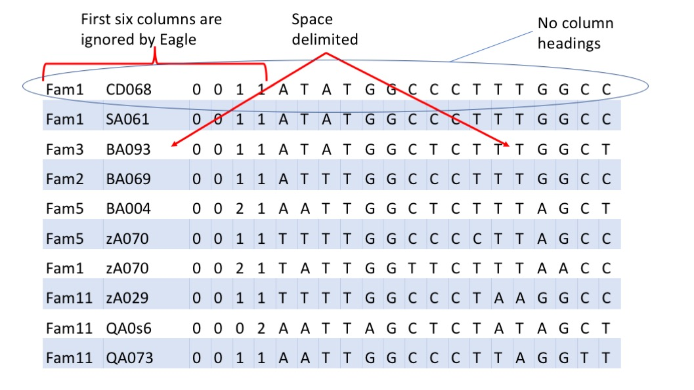
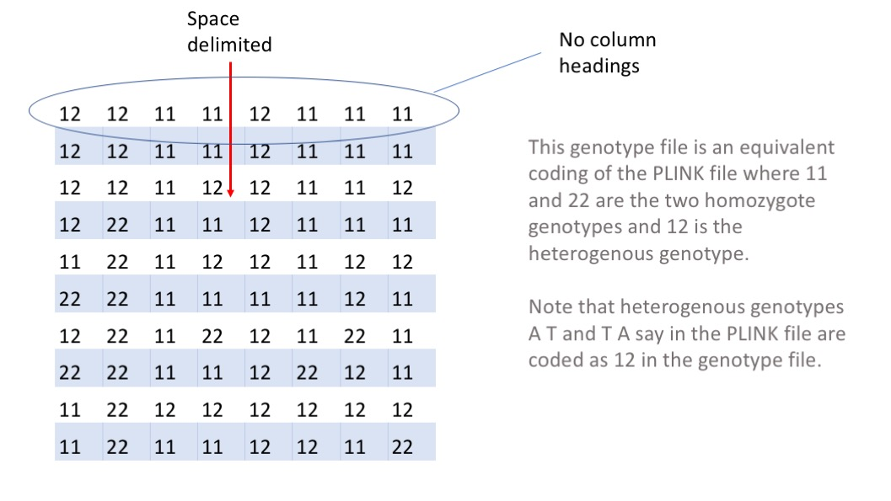
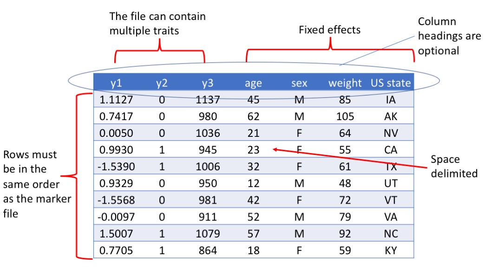
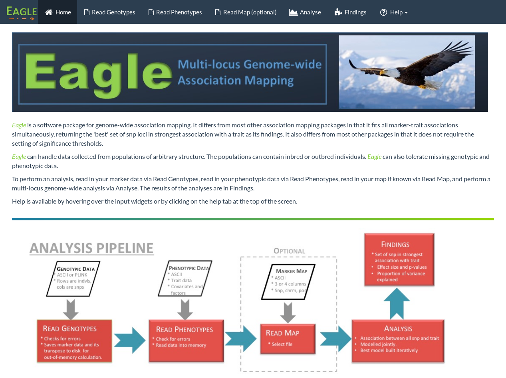
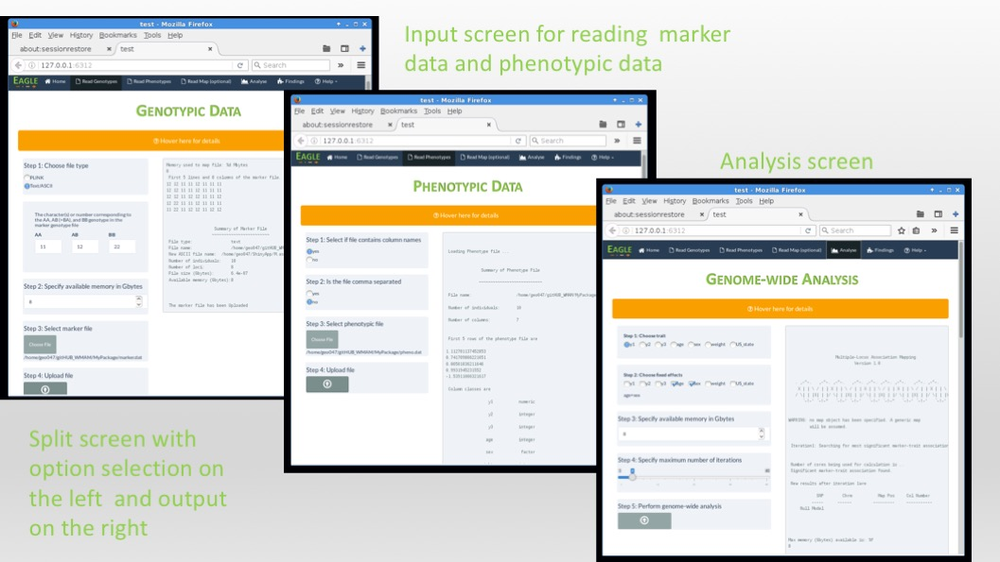
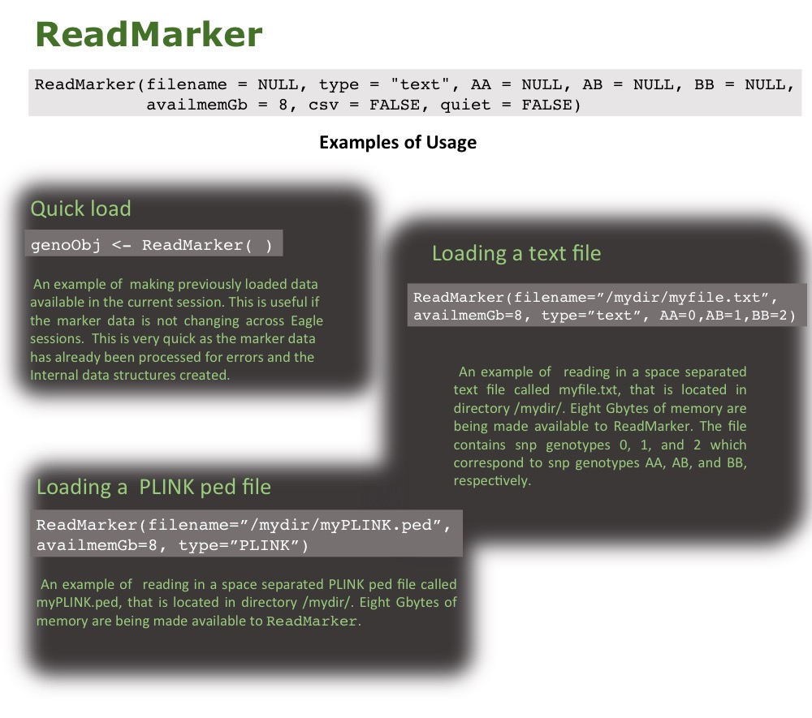
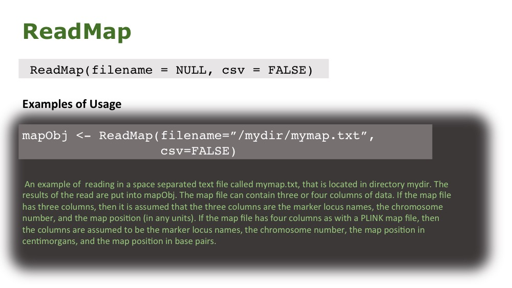
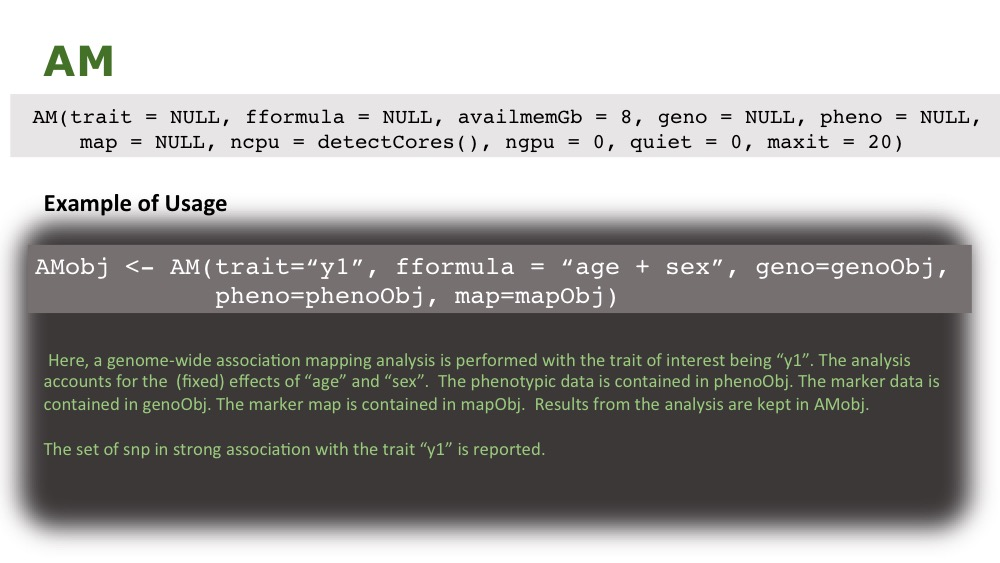
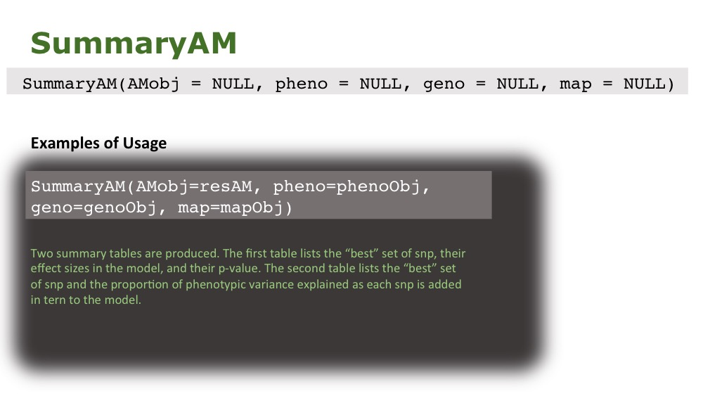

```{r include = FALSE}
library(Eagle)
```
<font style="color:darkred; font-variant: small-caps"><center> <h1>Eagle 1.0</h1> </center>
<center> <h1>Quick Start Guide</h1> </center></font>
<font style="color:grey"> <center> <h3>Andrew W. George</h3> </center></font>
<br>

<font style="color:darkred"> <h1> Where to Start </h1></font>
<font size="3"> As a starting point, we will assume that you have a current version of  [R](https://www.r-project.org/about.html) and that you have successful installed Eagle (see our InstallationGuide vignette for details). You have your marker data in one 
file and your phenotypic data in a separate file. You may or may not have a map file. You are looking to use Eagle to find the regions of the genome that house genes that are influencing a trait of interest. You want to perform an association mapping analysis to find these regions. This guide will help you get started analysing your data with Eagle. </font>

<font style="color:darkred"> <h1> Marker Data Format </h1> </font>

<font size="3"> Eagle can handle the marker data in two different formats; as a  space separated
[PLINK](https://www.cog-genomics.org/plink/1.9/) ped file or as a plain space separated ASCII text file. Missing 
marker genotypes are allowed but ideally, would be imputed prior to analysis. 

An example of a PLINK file is as follows:
 </font>



<font size="3"> and an example the same marker data coded as a plain ASCII marker genotype file is:


<font size="3"> Notice that neither file has column headings. Also, the genotype codes used in the plain ASCII file can be any alphanumeric value, as long as the same coding is used for all the loci. For example, we could have coded the snp genotypes 11, 12, and 22, or aa, ab, or bb, or even orange, apple, pear. The only restriction is that the plain ASCII file can  have only a single heterozygous class, i.e. we cannot have 12 and 21, or ab and ba. Eagle will terminate with an error otherwise. 
</font>

<font style="color:darkred"> <h1> Phenotypic Data Format </h1> </font>

<font size="3">The data file for the phenotypic data can be space separated or comma separate. The first row of the file can be the column headings. The file can contain data on multiple traits and fixed effects. Missing values, coded as `NA` is allowed for the traits
and fixed effects. 

An example of a phenotypic file is:
<\font>





# How to load Eagle

Eagle is an R package that is best run from an interactive session in R. Once an interactive R session has been opened, type the following command

```{r eval=FALSE}
library("Eagle")
```

This loads the Eagle package into the R session, making all the Eagle functions available to the user. 


# Running Eagle via the Web App

The easiest way to perform an analysis with Eagle is via our web application. At the R command prompt, 
just type

```{r eval=FALSE}
RunApp()
```
which will open your web browser to the following 



The menu items at the top of the page can then be used to read in the marker data, read in the
phenotypic data, read in a marker map if known, and perform the analysis. 





# Running Eagle from the R prompt

Here, we will present the Eagle functions 
for reading in the data, performing an analysis, and 
summarizing the results. 

## Reading in marker data
The Eagle function for reading in marker data is `ReadMarker`. 
It can be used in three ways:

1. for a quick load. If the marker data has been loaded in a previous Eagle session, and you are running R from the same directory as your previous Eagle session, then a quick load is possible.  
2. for reading a text file containing marker genotypes.
3. for reading a PLINK ped file




## Reading in phenotypic data

The Eagle function for reading in the phenotypic data is `ReadPheno`. It accepts 
space or comma separated data. The first row of the file can contain column names. 


## Reading in map data

The Eagle function for reading in a marker map is 'ReadMap'. 
Eagle does not require a marker map for association mapping. However,
a marker map can be useful for interpreting results. 



## Analysing data 

The function for performing genome-wide association mapping of data 
under a multiple-locus model is `AM`. 



## Summarizing the findings

Once `AM` has been run, a summary of the results can be obtained by running 
`SummaryAM`. 





